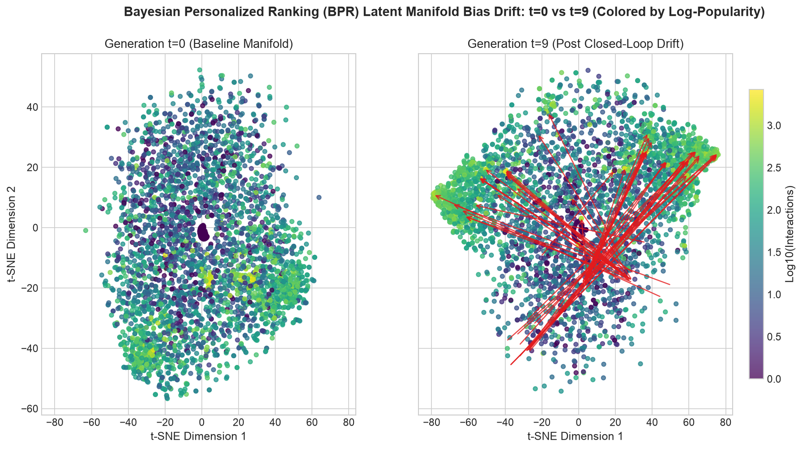
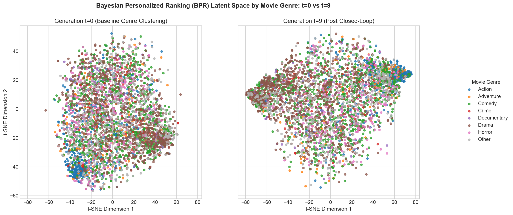
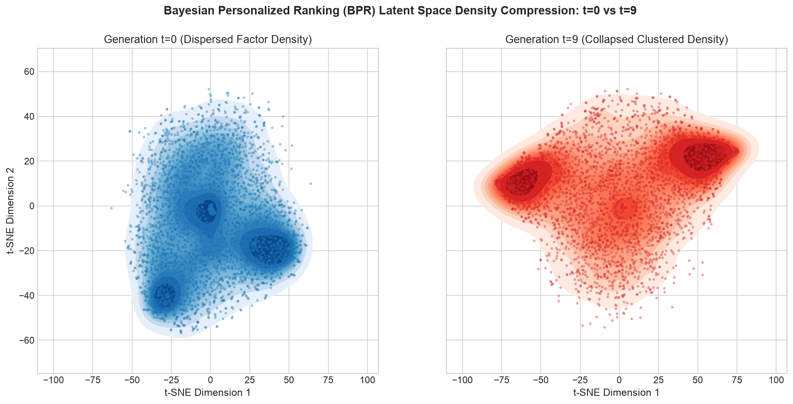
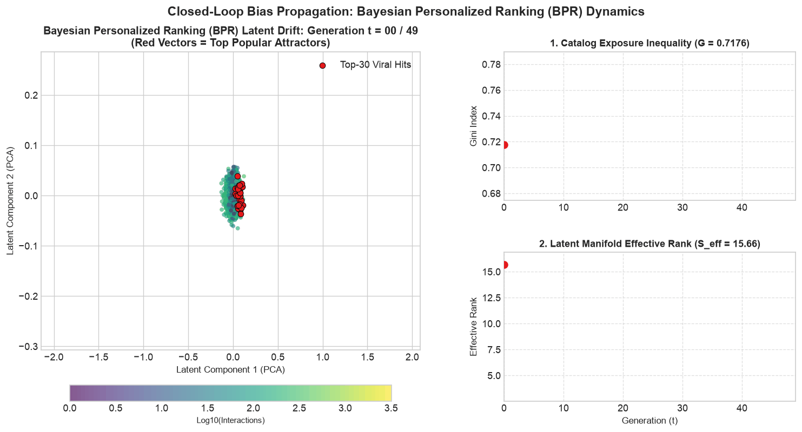
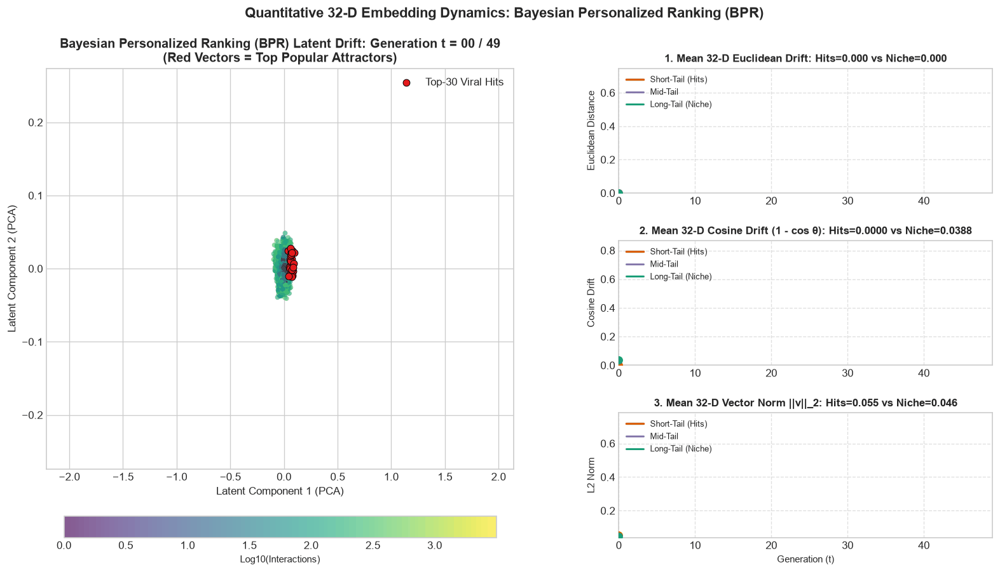

# Phase 4 Research Notes: Visualizing Closed-Loop Bias with 2D Maps (t-SNE)

**Notebook Reference**: [`notebooks/phase_4_tsne_visualization.ipynb`](../../notebooks/phase_4_tsne_visualization.ipynb)  
**Visual Assets Folder**: [`docs/images/phase_4_tsne_visualization/`](../images/phase_4_tsne_visualization/)

---

## Executive Summary: What Happens in a Feedback Loop?

When you use a streaming platform or online store, the system suggests items you might like. When you click on those suggestions, the platform records your click and uses it to update its recommendation model for tomorrow.

This creates a **closed feedback loop**:
```
User clicks on recommendations  --->  Data added to system  --->  Model retrains on its own outputs  --->  Bias compounds
```

If left unchecked, the algorithm begins to "eat its own tail." It keeps recommending what is already popular, gets more clicks on those popular items, and becomes convinced that nothing else matters. In this phase, we use 2D maps (**t-SNE**) and diagnostic trajectory charts to visually show how algorithms trap users, warp movie genres, and collapse into echo chambers over 10 rounds (generations) of feedback.

---

## The Simulation Setup (Plain English)

* **Dataset**: MovieLens-1M (over 6,000 real movie watchers, 3,533 movies, and 18 genres).
* **Feedback Duration**: 10 successive rounds (generations $t=0$ to $t=9$).
* **User Behavior**: In each round, users receive a list of 10 recommendations. They choose what to click using a mix of their authentic taste ($20\%$) and natural conformity to popular titles ($80\%$).
* **The Contenders**:
  1. **Most Popular (MostPop)**: A baseline that simply recommends the biggest blockbusters to everyone.
  2. **Matrix Factorization (MF)**: Pointwise collaborative filtering optimizing squared rating prediction error.
  3. **Bayesian Personalized Ranking (BPR)**: A pairwise ranking model optimizing the relative preference order between clicked and unclicked items.
  4. **Probabilistic Matrix Factorization (PMF)**: A generative model placing Gaussian priors on user and item latent representations.

---

## Visual Walkthrough & Findings

### Visual 1: The Multi-Tier Benchmark Dashboard
🔗 **Direct Asset Link**: [benchmark_trajectories.png](../images/phase_4_tsne_visualization/benchmark_trajectories.png)


#### 1. What You Are Looking At:
* **The 4 Charts**: Each quadrant tracks one critical health metric of the recommender across the 10 generations ($x$-axis: Generation 0 to 9).
* **Lines & Colors**:
  * **Blue**: Matrix Factorization (MF)
  * **Orange**: Bayesian Personalized Ranking (BPR)
  * **Purple**: Most Popular Baseline (MostPop)
  * **Shaded Bands**: Standard deviation across multiple randomized runs (consistency check).

#### 2. What the Charts Show:
* **Top-Left (Catalog Exposure Inequality — Gini Index)**:
  * *What it means*: Measures fairness. A score of $1.0$ means all recommendation slots go to a handful of blockbusters; a low score means the catalog is shared evenly.
  * *Finding*: MostPop is perpetually stuck at extreme inequality ($G \approx 0.99$). Notice how BPR steadily climbs upward over time ($0.53 \to 0.554+$). Even though BPR is a personalized model, the feedback loop steadily forces it to showcase fewer unique movies.
* **Top-Right (Taste Drift — KL Divergence)**:
  * *What it means*: Measures how far users are nudged away from their true initial movie tastes.
  * *Finding*: MostPop plummets because it forces all users into the exact same narrow mainstream bucket, stripping away personal individuality.
* **Bottom-Left (Recommendation Accuracy — NDCG@10)**:
  * *What it means*: How accurately the algorithm predicts what users actually want on held-out test data.
  * *Finding*: MostPop collapses by **over 34%** (from $0.0787$ down to $0.0516$). Recommending only popular hits quickly exhausts user interest and fails to satisfy personal preferences.
* **Bottom-Right (Variety of Representation Topics — Effective Rank)**:
  * *What it means*: Measures how many independent "topics" or "dimensions" the model uses to understand movies. If it drops, the model is seeing the world in fewer colors.
  * *Finding*: MostPop has an effective rank of exactly $1.0$ (it only understands one concept: popularity). BPR steadily loses dimensionality ($31.87 \to 31.78$), proving that the latent space is compressing.

---

### Visual 2: The Popularity Gravity Trap
* **Assets by Model**:
  * **BPR**: [docs/images/phase_4_tsne_visualization/bpr/tsne_popularity_drift.png](../images/phase_4_tsne_visualization/bpr/tsne_popularity_drift.png)
  * **MF**: [docs/images/phase_4_tsne_visualization/mf/tsne_popularity_drift.png](../images/phase_4_tsne_visualization/mf/tsne_popularity_drift.png)
  * **PMF**: [docs/images/phase_4_tsne_visualization/pmf/tsne_popularity_drift.png](../images/phase_4_tsne_visualization/pmf/tsne_popularity_drift.png)



#### 1. What You Are Looking At:
* A 2D map of all 3,533 movies generated using joint t-SNE (so both maps share the exact same coordinate system).
* **Colors**: Points are shaded by log-popularity:
  * **Bright Yellow / Light Green**: Heavy blockbusters with thousands of ratings (e.g., *Star Wars*, *Titanic*, *Jurassic Park*).
  * **Deep Purple**: Niche, long-tail movies with few ratings.
* **Left Panel ($t=0$)**: The starting baseline before any feedback loops begin.
* **Right Panel ($t=9$)**: The state of the movie world after 10 feedback iterations.
* **Red Arrows**: Trace the physical movement of the top-50 most popular movies from their starting point to their ending point.

#### 2. What is Happening:
* In the left panel ($t=0$), popular and niche movies are reasonably distributed across different clusters according to their style.
* By generation 9 (right panel), the red arrows all point inward toward tight clusters. Popular movies are pulled together into dense "super-attractors."

#### 3. Core Takeaway:
Popular movies act like **black holes with gravitational pull**. Because they receive more recommendation slots and clicks, the model updates their coordinates aggressively, dragging them into the center of the taste space. Meanwhile, niche purple movies on the periphery are virtually abandoned—they never get recommended, never get clicked, and freeze in place.

---

### Visual 3: Blurring Movie Genres
* **Assets by Model**:
  * **BPR**: [docs/images/phase_4_tsne_visualization/bpr/tsne_genre_clusters.png](../images/phase_4_tsne_visualization/bpr/tsne_genre_clusters.png)
  * **MF**: [docs/images/phase_4_tsne_visualization/mf/tsne_genre_clusters.png](../images/phase_4_tsne_visualization/mf/tsne_genre_clusters.png)
  * **PMF**: [docs/images/phase_4_tsne_visualization/pmf/tsne_genre_clusters.png](../images/phase_4_tsne_visualization/pmf/tsne_genre_clusters.png)



#### 1. What You Are Looking At:
* The same 2D map of movies, but now colored by their primary movie genre: Action (blue), Comedy (orange), Drama (green), Thriller (red), Sci-Fi (purple), Romance (brown), Adventure (pink), and Other (gray).
* **Left Panel ($t=0$)**: Clean genre separations before feedback loops.
* **Right Panel ($t=9$)**: Genre distribution after 10 generations.

#### 2. What is Happening:
* At $t=0$, genres naturally group into their own neighborhoods (e.g., Comedies hang out together, Action films group in their own cluster).
* At $t=9$, the borders between genres start bleeding and blurring. Items from different genres are mashed into the same clusters.

#### 3. Core Takeaway:
**Popularity trumps genre identity.** If an Action film like *The Matrix* and a Romance/Drama like *Titanic* are both blockbuster hits, users click on both. The algorithm notices this co-occurrence and decides: *"These movies must be similar!"* Over time, it forgets what makes an Action movie an Action movie and simply clusters movies by whether they are hits or not.

---

### Visual 4: Latent Space Density Compression (KDE)
* **Assets by Model**:
  * **BPR**: [docs/images/phase_4_tsne_visualization/bpr/tsne_manifold_density.png](../images/phase_4_tsne_visualization/bpr/tsne_manifold_density.png)
  * **MF**: [docs/images/phase_4_tsne_visualization/mf/tsne_manifold_density.png](../images/phase_4_tsne_visualization/mf/tsne_manifold_density.png)
  * **PMF**: [docs/images/phase_4_tsne_visualization/pmf/tsne_manifold_density.png](../images/phase_4_tsne_visualization/pmf/tsne_manifold_density.png)



#### 1. What You Are Looking At:
* A contour density map (Kernel Density Estimation) showing where movies are concentrated in the algorithm's mathematical mind.
* **Blue Contours (Left, $t=0$)**: Baseline spatial dispersion.
* **Red Contours (Right, $t=9$)**: Final spatial density after 10 generations.

#### 2. What is Happening:
* At $t=0$, the blue density lines are spread out smoothly with multiple gentle peaks. Movies occupy a rich, multi-polar universe.
* At $t=9$, the red density lines contract into sharp, concentrated bullseyes. Large areas of the coordinate space become completely empty wastelands.

#### 3. Core Takeaway:
This is visual proof of **representation collapse**. The algorithm is effectively dumbing itself down. Even though it has 16 or 32 mathematical dimensions available to capture nuances in taste, it collapses its attention onto a small, dense island of safe bets.

---

### Visual 5: 50-Generation Dynamic Embedding Drift Animation (GIF)
* **Animations by Model**:
  * **BPR Animation**: [docs/images/phase_4_tsne_visualization/bpr/embedding_drift_trajectory.gif](../images/phase_4_tsne_visualization/bpr/embedding_drift_trajectory.gif)
  * **MF Animation**: [docs/images/phase_4_tsne_visualization/mf/embedding_drift_trajectory.gif](../images/phase_4_tsne_visualization/mf/embedding_drift_trajectory.gif)
  * **PMF Animation**: [docs/images/phase_4_tsne_visualization/pmf/embedding_drift_trajectory.gif](../images/phase_4_tsne_visualization/pmf/embedding_drift_trajectory.gif)



#### 1. What You Are Looking At:
* An animated 50-frame sequence tracking continuous closed-loop feedback across 50 generations ($t=0 \to 49$).
* **Left Panel**: 2D projection of all 3,533 movies (points colored by log-popularity from deep purple to bright yellow). The red trailing paths and arrows track the top-30 most popular viral blockbusters across time.
* **Right Top Panel**: Live tracking of **Catalog Exposure Inequality (Gini)** climbing upward as time progresses.
* **Right Bottom Panel**: Live tracking of **Latent Manifold Effective Rank** decaying frame-by-frame.

#### 2. What is Happening Across Time:
* **Generations $0 \to 15$**: Initial rapid migration. The top popular movies pull away from their starting clusters and head directly toward central attractor hubs.
* **Generations $15 \to 35$**: Compounding inequality. Niche long-tail items (purple dots) freeze on the periphery, receiving negligible gradient updates.
* **Generations $35 \to 49$**: Saturation and collapse. The popular movies consolidate into super-dense attractors, while Effective Rank drops and Gini stabilizes at high inequality.

#### 3. Core Takeaway:
Seeing the animation play in real time brings the theory to life: **recommendation feedback loops are physical attractors**. You can directly watch the algorithm contract its worldview as it prioritizes short-term clicks over diverse long-term discovery.

---

### Visual 6: 32-Dimensional Quantitative Drift Trajectory Animation (GIF)
* **Quantitative Animations by Model**:
  * **BPR Quantitative Animation**: [docs/images/phase_4_tsne_visualization/bpr/quantitative_embedding_drift_trajectory.gif](../images/phase_4_tsne_visualization/bpr/quantitative_embedding_drift_trajectory.gif)
  * **MF Quantitative Animation**: [docs/images/phase_4_tsne_visualization/mf/quantitative_embedding_drift_trajectory.gif](../images/phase_4_tsne_visualization/mf/quantitative_embedding_drift_trajectory.gif)
  * **PMF Quantitative Animation**: [docs/images/phase_4_tsne_visualization/pmf/quantitative_embedding_drift_trajectory.gif](../images/phase_4_tsne_visualization/pmf/quantitative_embedding_drift_trajectory.gif)



#### 1. What You Are Looking At:
* A dedicated 50-frame animation displaying **exact full-dimensional mathematical measurements** computed directly on the **32-dimensional item vectors** without relying solely on 2D projections.
* **Left Panel**: 2D PCA projection of the 32-D space with red attractor arrows tracing the top 30 viral hits.
* **Right Panels (3 Live Synchronized Metric Dashboards)**:
  1. **Top (32-D Euclidean Drift $\bar{d}_{\text{Euc}}$)**: Tracks true straight-line physical displacement in $\mathbb{R}^{32}$ from Generation $0$ to $t$ after Procrustes alignment.
  2. **Middle (32-D Cosine Drift $\bar{d}_{\text{Cos}}$)**: Tracks pure angular rotation ($1 - \cos \theta$) of movie taste profiles, independent of vector length.
  3. **Bottom (32-D Vector Norm $\bar{\|\mathbf{v}\|}_2$)**: Tracks the physical magnitude/length of the vectors.
* **Color Curves by Popularity Tier**:
  * **Orange Curve**: Short-tail viral hits ($\ge 250$ ratings).
  * **Purple Curve**: Mid-tail titles ($50 - 249$ ratings).
  * **Green Curve**: Long-tail niche titles ($< 50$ ratings).

#### 2. What the Quantitative Numbers Prove:
* **The Disparity Gap**: Short-tail blockbusters undergo massive Euclidean displacement and angular rotation as they are pulled toward mainstream user click hubs.
* **The Frozen Long Tail**: Niche green curves remain virtually flat near zero across all 50 generations. Because long-tail items receive almost no recommendation exposure or feedback clicks, their 32-D coordinates never receive gradient updates, mathematically freezing them in place.
* **Norm Inflation**: In MF and BPR, popular item vectors expand in magnitude, giving them an unfair mathematical advantage in dot product recommendations ($\mathbf{u}^\top \mathbf{v}_i$) over unexpanded niche vectors.

---

### Deep Dive: The 3 Quantitative Measures in Simple Words

When evaluating recommendation models, 2D maps (like t-SNE) are great for visual intuition, but they squash 32 dimensions into 2, which distorts true physical distances. To provide an accurate picture of what is happening inside the model's brain, we look at the full **32-dimensional item vectors** using three simple ideas:

```text
               Original 32-D Vector v_i^(0)
                        ▲
                        │ \
                        │  \  Euclidean Drift (Total distance)
         Angular Drift  │   \
         (Topic change) │ θ  \
                        │     ▼
                        └────────► New 32-D Vector v_i^(t)
                         (Length changes = Magnitude shift)
```

#### 1. 32-D Euclidean Drift — The "Odometer" of Movement
* **The Idea**: Think of Euclidean drift like a **car's GPS odometer**. It measures the straight-line physical distance a movie traveled across the full 32-dimensional space from round 0 to round $t$.
* **What it tells us**: *"Did this movie physically move in the algorithm's memory?"*
* **The Finding**: Popular blockbusters travel huge distances because they receive millions of click updates. Meanwhile, long-tail niche movies have an odometer reading near **zero**—they barely move because the algorithm never updates them.

#### 2. 32-D Cosine Drift — The "Compass" of Taste Orientation
* **The Idea**: Think of Cosine drift like a **compass needle**. It measures the pure **angle** by which a movie rotated away from its original style or genre, completely ignoring how long the vector is.
  * If the compass hasn't moved: the movie still represents the exact same taste profile.
  * If the compass has spun: the algorithm is reinterpreting what kind of movie it is.
* **What it tells us**: *"Has the core meaning or genre personality of this movie changed?"*
* **The Finding**: Blockbuster compasses spin dramatically toward mainstream click hubs. The algorithm forgets the movie's authentic niche identity and re-labels it as generic popular content.

#### 3. 32-D Vector Norm — The "Megaphone" of Algorithmic Influence
* **The Idea**: Vector norm measures the **physical length** of the vector. In recommendation algorithms, items with longer vectors automatically produce higher scores. Think of vector length as the **volume of a megaphone**. A movie with a huge vector shouts much louder than a movie with a tiny vector.
* **What it tells us**: *"How aggressively is the algorithm trying to push this movie?"*
* **The Finding**: Because popular movies get clicked so often, the algorithm stretches their vector lengths (**Norm Inflation**). Even if an indie movie is a better match for a user's authentic taste, the blockbuster's giant megaphone drowns it out and steals the recommendation slot.

#### 4. The Guardrail: Procrustes Alignment (The "Spinning Globe")
* **The Problem**: Every time an AI model retrains, the coordinate axes can randomly spin—just like spinning a globe. The continents stay in the same place relative to each other, but their coordinates change. If you measure distance without locking the globe in place, you would measure fake movement caused by random axis rotation.
* **The Fix**: We use **Procrustes Alignment** to lock the globe in place before measuring. This guarantees that every bit of movement we measure is **100% genuine algorithmic bias**, not random training noise.

---


### Model Architecture Comparison: How MF, PMF, and BPR React Differently

| Model | Loss Formulation | Geometric Drift Signature | Physical Behavior in Plain English |
| :--- | :--- | :--- | :--- |
| **BPR** (*Bayesian Personalized Ranking*) | Pairwise ranking: $\ln \sigma(\hat{x}_{u,i} - \hat{x}_{u,j})$ | Strong genre boundary erasure & tight cluster merging | Because it only cares whether item $i$ ranks above item $j$, popular items that get co-clicked across diverse users rapidly overpower niche items. Movie genres bleed together into generic "blockbuster" clumps. |
| **MF** (*Pointwise Matrix Factorization*) | Pointwise MSE: $(r_{u,i} - \mathbf{u}_u^\top \mathbf{v}_i)^2$ | Direct inward density compression toward interaction center | Minimizes prediction error point-by-point. Items with thousands of clicks generate huge gradients that dominate the loss function, aggressively pulling popular factors toward high-activity user centers while tail items receive almost no gradient force. |
| **PMF** (*Probabilistic Matrix Factorization*) | Gaussian priors: $\mathcal{N}(0, \sigma_U^2 I), \mathcal{N}(0, \sigma_V^2 I)$ | Two-tier core-periphery segregation (Prior Anchor effect) | The Gaussian prior acts like a rubber band pulling unobserved movies toward the origin $(0, 0)$. Popular items receive enough click evidence to break free from the rubber band, while niche long-tail items stay anchored near the center. This creates a stark division between "orbiting viral hits" and "frozen background items". |


---

## Summary of Key Takeaways

> [!IMPORTANT]
> When recommendation algorithms feed on their own outputs over multiple generations without debiasing safeguards:
> 1. **Hits become gravity traps**: Popular movies act like black holes with massive pull, dragging the algorithm's coordinate space inward and clustering together regardless of genre.
> 2. **Niche items get starved**: Obscure, long-tail movies are pushed to the outer rim, receive zero recommendations, and freeze in place.
> 3. **The algorithm "dumbs itself down"**: The system's worldview physically shrinks—collapsing from a rich, diverse space into a few hyper-dense echo chambers of safe viral hits.

---

## Practical Takeaways for Recommender Systems

1. **Self-Fulfilling Prophecy**: Recommendation systems don't just predict user taste; they actively manufacture it. Once a hit gets an early lead, feedback loops ensure it stays on top.
2. **Short-Term Clicks vs. Long-Term Health**: While recommending popular hits might get safe clicks in round 1, by round 10 user utility and accuracy degrade significantly (as shown by MostPop losing 34% NDCG).
3. **The Cure**: To prevent this collapse, systems need:
   * **Exploration Bonuses**: Regularly injecting high-quality niche items into recommendations.
   * **Popularity Penalties (Debiasing)**: Discounting clicks on blockbusters so niche items have a fair chance to compete.
   * **Coverage Invariants**: Monitoring catalog Gini and effective rank as primary health metrics, not just click-through rate.

