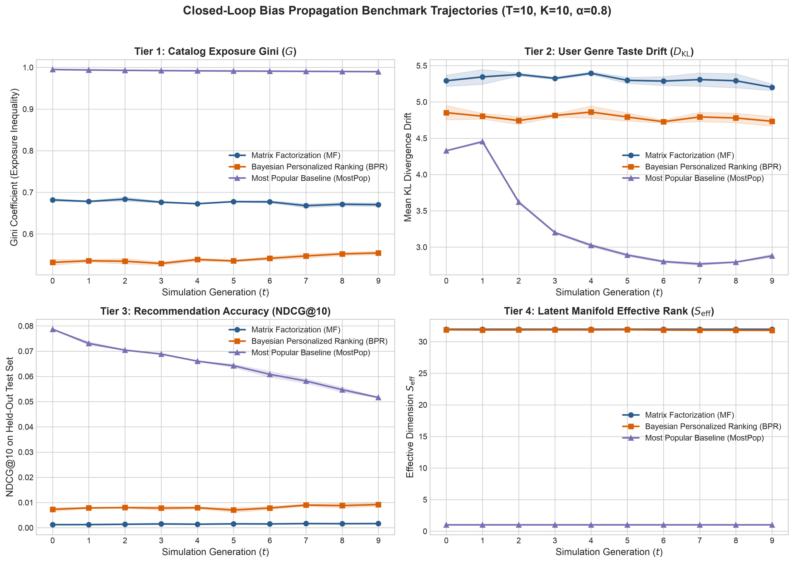
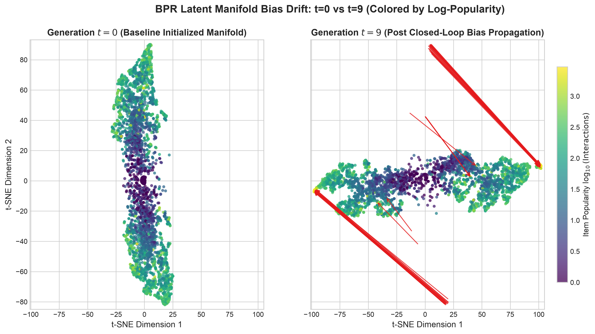
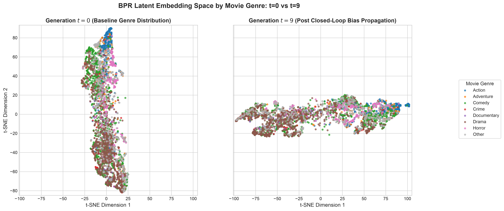
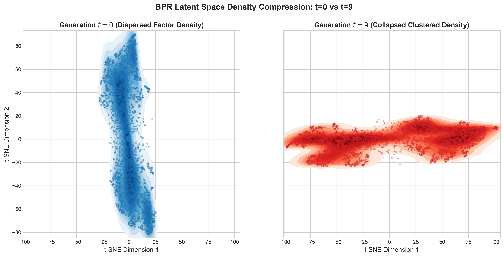

# Phase 4 Research Notes: Visualizing Closed-Loop Bias with 2D Maps (t-SNE)

**Notebook Reference**: [`notebooks/phase_4_tsne_visualization.ipynb`](../../notebooks/phase_4_tsne_visualization.ipynb)  
**Visual Assets Folder**: [`docs/images/phase_4_tsne_visualization/`](../images/phase_4_tsne_visualization/)

---

## Executive Summary: What Happens in a Feedback Loop?

When you use a streaming platform or online store, the system suggests items you might like. When you click on those suggestions, the platform records your click and uses it to update its recommendation model for tomorrow.

This creates a **closed feedback loop**:
```
User clicks on recommendations  --->  Data added to system  --->  Model retrains on its own outputs  --->  Bias compounds
```

If left unchecked, the algorithm begins to "eat its own tail." It keeps recommending what is already popular, gets more clicks on those popular items, and becomes convinced that nothing else matters. In this phase, we use 2D maps (**t-SNE**) and diagnostic trajectory charts to visually show how algorithms trap users, warp movie genres, and collapse into echo chambers over 10 rounds (generations) of feedback.

---

## The Simulation Setup (Plain English)

* **Dataset**: MovieLens-1M (over 6,000 real movie watchers, 3,533 movies, and 18 genres).
* **Feedback Duration**: 10 successive rounds (generations $t=0$ to $t=9$).
* **User Behavior**: In each round, users receive a list of 10 recommendations. They choose what to click using a mix of their authentic taste ($20\%$) and natural conformity to popular titles ($80\%$).
* **The Contenders**:
  1. **Most Popular (MostPop)**: A baseline that simply recommends the biggest blockbusters to everyone.
  2. **Matrix Factorization (MF)**: Standard collaborative filtering that maps users and items to hidden preference vectors.
  3. **Bayesian Personalized Ranking (BPR)**: A popular ranking model designed to figure out which items a user prefers over others.

---

## Visual Walkthrough & Findings

### Visual 1: The Multi-Tier Benchmark Dashboard
🔗 **Direct Asset Link**: [benchmark_trajectories.png](../images/phase_4_tsne_visualization/benchmark_trajectories.png)



#### 1. What You Are Looking At:
* **The 4 Charts**: Each quadrant tracks one critical health metric of the recommender across the 10 generations ($x$-axis: Generation 0 to 9).
* **Lines & Colors**:
  * **Blue**: Matrix Factorization (MF)
  * **Orange**: Bayesian Personalized Ranking (BPR)
  * **Purple**: Most Popular Baseline (MostPop)
  * **Shaded Bands**: Standard deviation across multiple randomized runs (consistency check).

#### 2. What the Charts Show:
* **Top-Left (Catalog Exposure Inequality — Gini Index)**:
  * *What it means*: Measures fairness. A score of $1.0$ means all recommendation slots go to a handful of blockbusters; a low score means the catalog is shared evenly.
  * *Finding*: MostPop is perpetually stuck at extreme inequality ($G \approx 0.99$). Notice how BPR steadily climbs upward over time ($0.53 \to 0.554+$). Even though BPR is a personalized model, the feedback loop steadily forces it to showcase fewer unique movies.
* **Top-Right (Taste Drift — KL Divergence)**:
  * *What it means*: Measures how far users are nudged away from their true initial movie tastes.
  * *Finding*: MostPop plummets because it forces all users into the exact same narrow mainstream bucket, stripping away personal individuality.
* **Bottom-Left (Recommendation Accuracy — NDCG@10)**:
  * *What it means*: How accurately the algorithm predicts what users actually want on held-out test data.
  * *Finding*: MostPop collapses by **over 34%** (from $0.0787$ down to $0.0516$). Recommending only popular hits quickly exhausts user interest and fails to satisfy personal preferences.
* **Bottom-Right (Variety of Representation Topics — Effective Rank)**:
  * *What it means*: Measures how many independent "topics" or "dimensions" the model uses to understand movies. If it drops, the model is seeing the world in fewer colors.
  * *Finding*: MostPop has an effective rank of exactly $1.0$ (it only understands one concept: popularity). BPR steadily loses dimensionality ($31.87 \to 31.78$), proving that the latent space is compressing.

---

### Visual 2: The Popularity Gravity Trap
🔗 **Direct Asset Link**: [tsne_popularity_drift.png](../images/phase_4_tsne_visualization/tsne_popularity_drift.png)



#### 1. What You Are Looking At:
* A 2D map of all 3,533 movies generated using joint t-SNE (so both maps share the exact same coordinate system).
* **Colors**: Points are shaded by log-popularity:
  * **Bright Yellow / Light Green**: Heavy blockbusters with thousands of ratings (e.g., *Star Wars*, *Titanic*, *Jurassic Park*).
  * **Deep Purple**: Niche, long-tail movies with few ratings.
* **Left Panel ($t=0$)**: The starting baseline before any feedback loops begin.
* **Right Panel ($t=9$)**: The state of the movie world after 10 feedback iterations.
* **Red Arrows**: Trace the physical movement of the top-50 most popular movies from their starting point to their ending point.

#### 2. What is Happening:
* In the left panel ($t=0$), popular and niche movies are reasonably distributed across different clusters according to their style.
* By generation 9 (right panel), the red arrows all point inward toward tight clusters. Popular movies are pulled together into dense "super-attractors."

#### 3. Core Takeaway:
Popular movies act like **black holes with gravitational pull**. Because they receive more recommendation slots and clicks, the model updates their coordinates aggressively, dragging them into the center of the taste space. Meanwhile, niche purple movies on the periphery are virtually abandoned—they never get recommended, never get clicked, and freeze in place.

---

### Visual 3: Blurring Movie Genres
🔗 **Direct Asset Link**: [tsne_genre_clusters.png](../images/phase_4_tsne_visualization/tsne_genre_clusters.png)



#### 1. What You Are Looking At:
* The same 2D map of movies, but now colored by their primary movie genre: Action (blue), Comedy (orange), Drama (green), Thriller (red), Sci-Fi (purple), Romance (brown), Adventure (pink), and Other (gray).
* **Left Panel ($t=0$)**: Clean genre separations before feedback loops.
* **Right Panel ($t=9$)**: Genre distribution after 10 generations.

#### 2. What is Happening:
* At $t=0$, genres naturally group into their own neighborhoods (e.g., Comedies hang out together, Action films group in their own cluster).
* At $t=9$, the borders between genres start bleeding and blurring. Items from different genres are mashed into the same clusters.

#### 3. Core Takeaway:
**Popularity trumps genre identity.** If an Action film like *The Matrix* and a Romance/Drama like *Titanic* are both blockbuster hits, users click on both. The algorithm notices this co-occurrence and decides: *"These movies must be similar!"* Over time, it forgets what makes an Action movie an Action movie and simply clusters movies by whether they are hits or not.

---

### Visual 4: Latent Space Density Compression (KDE)
🔗 **Direct Asset Link**: [tsne_manifold_density.png](../images/phase_4_tsne_visualization/tsne_manifold_density.png)



#### 1. What You Are Looking At:
* A contour density map (Kernel Density Estimation) showing where movies are concentrated in the algorithm's mathematical mind.
* **Blue Contours (Left, $t=0$)**: Baseline spatial dispersion.
* **Red Contours (Right, $t=9$)**: Final spatial density after 10 generations.

#### 2. What is Happening:
* At $t=0$, the blue density lines are spread out smoothly with multiple gentle peaks. Movies occupy a rich, multi-polar universe.
* At $t=9$, the red density lines contract into sharp, concentrated bullseyes. Large areas of the coordinate space become completely empty wastelands.

#### 3. Core Takeaway:
This is visual proof of **representation collapse**. The algorithm is effectively dumbing itself down. Even though it has 16 or 32 mathematical dimensions available to capture nuances in taste, it collapses its attention onto a small, dense island of safe bets.

---

## Practical Takeaways for Recommender Systems

1. **Self-Fulfilling Prophecy**: Recommendation systems don't just predict user taste; they actively manufacture it. Once a hit gets an early lead, feedback loops ensure it stays on top.
2. **Short-Term Clicks vs. Long-Term Health**: While recommending popular hits might get safe clicks in round 1, by round 10 user utility and accuracy degrade significantly (as shown by MostPop losing 34% NDCG).
3. **The Cure**: To prevent this collapse, systems need:
   * **Exploration Bonuses**: Regularly injecting high-quality niche items into recommendations.
   * **Popularity Penalties (Debiasing)**: Discounting clicks on blockbusters so niche items have a fair chance to compete.
   * **Coverage Invariants**: Monitoring catalog Gini and effective rank as primary health metrics, not just click-through rate.
