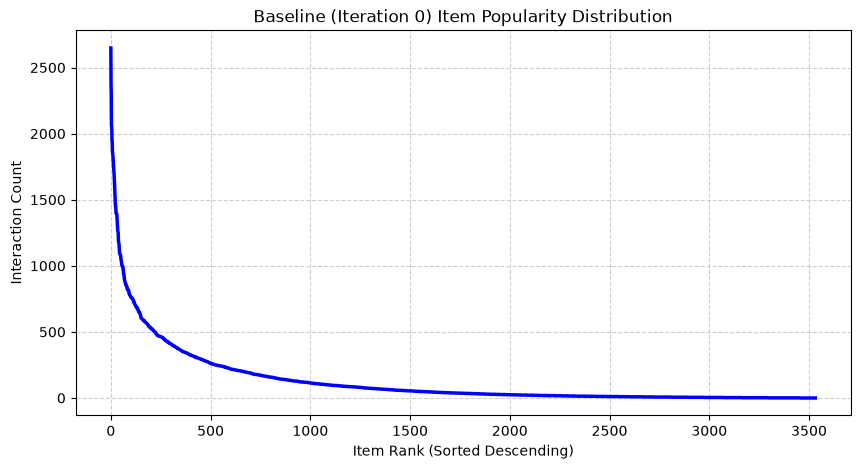

# Step 1.1: Ingestion and Encoding Optimization
The MovieLens-1M dataset stores structural records inside text files (e.g., movies.dat, ratings.dat) utilizing :: as a delimiter.
**The Encoding Challenge:** UTF-8 vs. Latin-1Standard modern text processors assume UTF-8 encoding. However, parsing older, curated datasets like MovieLens-1M with a default UTF-8 codec triggers a fatal UnicodeDecodeError when encountering bytes like 0xe9 (the accented character é in titles like Amélie).UTF-8 Mechanism: Interprets bytes using variable-length multi-byte sequences. Solved by configuring the ingestion pipeline with encoding='latin-1' which ensures clean, lossless data parsing into memory.

# Step 1.2: Implicit Binarization

```Python
liked_ratings = ratings[ratings['rating'] >= 4].copy()`
```

**The Motivation:** Real-world production recommender systems heavily leverage implicit feedback (clicks, watch time, purchases) rather than explicit ratings (1 to 5 stars). Explicit feedback is highly sparse and introduces human rating scale biases.
**The Operational Rule** To simulate an implicit feedback system, the raw ratings are binarized. Ratings of 4 and 5 are treated as strong indicators of positive utility ($1$), while lower ratings (1, 2, and 3) are completely discarded ($0$). The pipeline shifts focus from predicting how much a user will like an item to predicting the probability of interaction with an item.

# Step 1.3: Chronological Per-User Ordering

```Python
liked_ratings = liked_ratings.sort_values(by=['user_id', 'timestamp'])`
```

**The Motivation:** Random cross-validation splits (like a standard k-fold split) introduce severe temporal data leakage in recommendation research. If interactions are split randomly, a model will train on movies a user watched in the future to predict what they watched in the past.
**The Operational Rule:** Sorting interactions strictly by user_id and timestamp preserves the authentic evolution of user tastes over time. This configuration matches the reality of production platforms, which can only consume past interactions to influence future item discoveries.

# Step 1.4: Continuous Zero-Indexed Categorization

```Python
liked_ratings['user_code'] = liked_ratings['user_id'].astype('category').cat.codes
liked_ratings['item_code'] = liked_ratings['item_id'].astype('category').cat.codes
```

The MotivationRaw identification keys in relational databases frequently feature gaps due to deleted records, inactive accounts, or non-sequential primary key generation. For example, if a dataset contains 3,533 unique movies, but the highest raw ID is 3952, using raw keys directly forces downstream matrix layouts to allocate space for 3,953 columns. The empty columns between IDs result in wasted RAM allocations.The Operational RuleConverting IDs into internal Pandas categorical codes maps arbitrary identifiers to a tight, continuous index sequence starting exactly at $0$ and ending at $N-1$:
$$\text{User Keys} \in [0, \vert{}\mathcal{U}\vert{} - 1], \quad \text{Item Keys} \in [0, \vert{}\mathcal{I}\vert{} - 1]$$
This operation removes empty rows and columns, creating a dense coordinate space.

Step 1.5: Per-User Chronological Train/Test Split (80/20)

```Python
for user_code, group in liked_ratings.groupby('user_code'):
    n_interactions = len(group)
    split_idx = int(n_interactions * 0.8)
    ...
    train_rows.extend([user_code] * split_idx)
    train_cols.extend(user_items[:split_idx])
```

**The Motivation:** A global timestamp split can disadvantage users who registered early or late in the dataset's lifecycle. A per-user split ensures that every single active user maintains an independent history in the training matrix and an independent target evaluation set in the test matrix.

## The Array Mapping Process

To construct the sparse grids efficiently, the loop builds flat Coordinate (COO) arrays:
1. Row Coordinates (train_rows / test_rows): Repeats the specific integer user_code value for each valid interaction index.
2. Column Coordinates (train_cols / test_cols): Slices the first 80% of sorted item keys for training and appends the final 20% (the user's future interactions) to the test tracker arrays.

# Step 1.6: Compressed Sparse Row (CSR) Matrix Generation

```Python
train_matrix = csr_matrix((np.ones(len(train_rows)), (train_rows, train_cols)), shape=(num_users, num_items))
test_matrix = csr_matrix((np.ones(len(test_rows)), (test_rows, test_cols)), shape=(num_users, num_items))
```

**The Motivation** Storing a complete user-item interaction grid as a dense 2D array requires enormous memory. For a system tracking 6,040 users and 3,952 items, a dense matrix contains nearly 24 million cells. Since users interact with only a tiny fraction of the catalog, over 95% of those cells would hold zero values.The Sparse ResolutionThe Compressed Sparse Row (CSR) layout compresses massive matrices by storing only non-zero entries (nnz). It utilizes three dense 1D arrays: data (the values), indices (column positions), and indptr (row offsets).

$$\text{Memory Complexity: } \mathcal{O}(\vert{}\mathcal{U}\vert{} + \text{nnz}) \ll \mathcal{O}(\vert{}\mathcal{U}\vert{} \times \vert{}\mathcal{I}\vert{})$$

Additionally, CSR arrays optimize for instantaneous row-slicing operations ($\mathcal{O}(1)$ performance). When generating recommendations, the model can query an entire user's historical interaction row vector in constant time.

## Dimensional Alignment Constraint

By explicitly locking shape=(num_users, num_items), both matrices are guaranteed to share identical column counts and row bounds. This design prevents downstream linear algebra exceptions (ValueError: dimensions misaligned) when evaluating the model against items that may only exist in the test split.

# Baseline Inequality Quantification

```Python
def compute_gini(exposure_counts):
    x = np.sort(exposure_counts)
    n = len(x)
    cum = np.cumsum(x)
    return (n + 1 - 2 * np.sum(cum) / cum[-1]) / n
```
Before initiating the iterative simulation loop, we compute the baseline popularity statistics of the historical training matrix to establish our experiment controls.**The Gini Coefficient** The Gini Coefficient mathematically evaluates inequality across a distribution scale from $0.0$ (perfect equality) to $1.0$ (absolute inequality). In this project, the mathematical implementation uses a vectorized optimization of the absolute mean difference equation:

$$G = \frac{n + 1}{n} - \frac{2 \sum_{i=1}^n C_i}{n \cdot C_n}$$

Where:$n$ is the total count of unique tracked items ($3,533$).$C_i$ represents the cumulative interaction sum of items sorted from least popular to most popular.$C_n$ represents the absolute sum of all interactions across the entire matrix.

## Empirical Baseline Results

| **Metric** | **Measured Baseline Value** | **Conceptual Meaning** |
|------------|----------------------------:|------------------------|
| **Total Tracked Items** | `3,533` | Unique movies possessing ≥ 1 implicit positive interaction. |
| **Baseline Gini Coefficient** | `0.7176` | Severe systemic inequality in organic user interaction choices. |
| **Top 5% Concentration** | `37.43%` | A tiny group of head items accounts for over a third of the data. |

## Visualizing the Long-Tail Power Law



The resulting baseline line chart maps the sorted popularity values, illustrating a classic power-law long-tail curve:
The Head (Far Left): A steep, narrow cliff where a small cluster of blockbuster items draw hundreds of user clicks.
The Tail (Right Body): A long, flat plateau where the vast majority of items struggle to register regular user exposure.

This baseline confirms that the historical data is already highly concentrated. The subsequent phases will measure whether collaborative filtering models amplify this skewness or stabilize it over generations.
