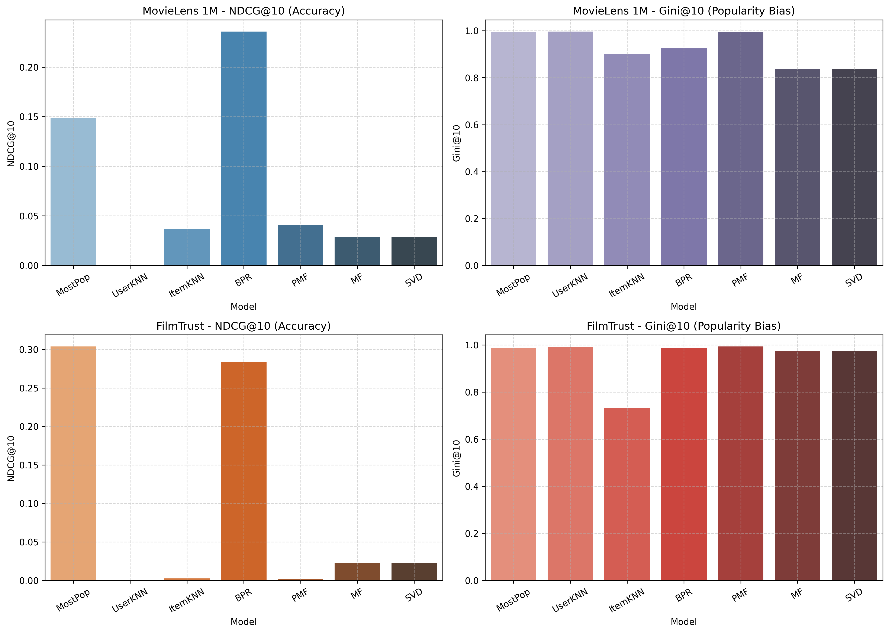

# Phase 2: Recommender Model Benchmarking with Cornac

## Overview

Phase 2 transitions from data preparation (Phase 1) to active model training and benchmarking using **Cornac**, a multimodal recommendation framework. This phase enables systematic evaluation of diverse recommender model families across multiple benchmark datasets while tracking both ranking accuracy and popularity bias / long-tail inequality metrics.

---

## Environment Isolation

All dependencies are installed in a local Python virtual environment (`.venv`):

```bash
python3 -m venv .venv
source .venv/bin/activate
pip install -r requirements.txt
python -m ipykernel install --user --name=recommender-bias-venv --display-name "Python (.venv)"
```

---

## Repository Structure for Phase 2

```text
.
├── notebooks/
│   ├── phase_1_data_prep.ipynb       # Phase 1: Data prep and baseline inequality
│   └── phase_2_cornac_benchmark.ipynb # Phase 2: Cornac model experimentation
├── docs/
│   ├── phase1_data_prep.md
│   └── phase2_cornac_models.md   # Documentation for Phase 2
├── papers/                       # Literature & PDF references
├── tex/                          # LaTeX manuscripts
├── logs/                         # Execution logs
├── requirements.txt
└── README.md
```

---

## Datasets

The benchmarking pipeline evaluates models across two distinct implicit-feedback datasets:

1. **MovieLens 1M**: 
   - ~1 million ratings from 6,038 users on 3,533 movies.
   - Binarized for implicit feedback (`rating >= 4.0`).
2. **FilmTrust**:
   - Compact benchmark dataset with 35,497 ratings from 1,508 users on 2,071 movies.
   - Useful for fast iteration and cross-dataset validation.

---

## Model Zoo & Empirical Results

The model zoo evaluates 7 recommendation algorithms across **MovieLens 1M** and **FilmTrust** (80/20 per-user split, positive rating threshold = 4.0 for MovieLens 1M, 3.5 for FilmTrust).

### 1. MovieLens 1M Benchmark Results

| Model Family | Algorithm | Cornac Class | NDCG@10 ↑ | Recall@10 ↑ | Precision@10 ↑ | MAP ↑ | MRR ↑ | Gini@10 ↓ (Popularity Bias) |
| --- | --- | --- | ---: | ---: | ---: | ---: | ---: | ---: |
| **Baseline** | MostPop | `MostPop` | 0.1489 | 0.0782 | 0.1262 | 0.0878 | 0.3107 | 0.9950 |
| **Neighborhood** | User KNN | `UserKNN` | 0.0003 | 0.0003 | 0.0004 | 0.0147 | 0.0178 | 0.9969 |
| **Neighborhood** | Item KNN | `ItemKNN` | 0.0367 | 0.0121 | 0.0408 | 0.0308 | 0.0809 | 0.9006 |
| **Pairwise MF** | BPR | `BPR` | **0.2359** | **0.1423** | **0.1966** | **0.1546** | **0.4345** | 0.9247 |
| **Probabilistic MF** | PMF | `PMF` | 0.0404 | 0.0269 | 0.0423 | 0.0311 | 0.0964 | 0.9937 |
| **Matrix Factorization** | MF | `MF` | 0.0283 | 0.0134 | 0.0279 | 0.0254 | 0.0781 | **0.8366** (Best Coverage) |
| **Latent Factor / SVD** | SVD | `SVD` | 0.0283 | 0.0134 | 0.0279 | 0.0254 | 0.0781 | **0.8366** (Best Coverage) |

### 2. FilmTrust Benchmark Results

| Model Family | Algorithm | Cornac Class | NDCG@10 ↑ | Recall@10 ↑ | Precision@10 ↑ | MAP ↑ | MRR ↑ | Gini@10 ↓ (Popularity Bias) |
| --- | --- | --- | ---: | ---: | ---: | ---: | ---: | ---: |
| **Baseline** | MostPop | `MostPop` | **0.3038** | **0.4497** | **0.1334** | **0.2500** | **0.3452** | 0.9866 |
| **Neighborhood** | User KNN | `UserKNN` | 0.0000 | 0.0000 | 0.0000 | 0.0023 | 0.0025 | 0.9930 |
| **Neighborhood** | Item KNN | `ItemKNN` | 0.0025 | 0.0050 | 0.0017 | 0.0035 | 0.0069 | **0.7317** (Best Coverage) |
| **Pairwise MF** | BPR | `BPR` | 0.2839 | 0.4339 | 0.1315 | 0.2354 | 0.3182 | 0.9866 |
| **Probabilistic MF** | PMF | `PMF` | 0.0020 | 0.0039 | 0.0014 | 0.0101 | 0.0121 | 0.9936 |
| **Matrix Factorization** | MF | `MF` | 0.0223 | 0.0295 | 0.0106 | 0.0174 | 0.0443 | 0.9746 |
| **Latent Factor / SVD** | SVD | `SVD` | 0.0223 | 0.0295 | 0.0106 | 0.0174 | 0.0443 | 0.9746 |

### 3. Accuracy vs. Popularity Bias Comparison Plot



---

## Key Empirical Takeaways

1. **BPR Dominates Ranking Accuracy**: **Bayesian Personalized Ranking (`BPR`)** achieves the highest accuracy on MovieLens 1M (`NDCG@10 = 0.2359`) and a strong second on FilmTrust (`NDCG@10 = 0.2839`), proving that pairwise optimization is highly effective for implicit top-N recommendation.
2. **Heavy Dataset Popularity Reliance**: The non-personalized baseline **`MostPop`** achieves top ranking performance on FilmTrust (`NDCG@10 = 0.3038`) and second-highest on MovieLens 1M (`NDCG@10 = 0.1489`), illustrating how heavily interactions in both benchmark datasets are concentrated around head items.
3. **Accuracy vs. Popularity Bias Trade-Off**: Models with high NDCG@10 scores (`BPR`, `MostPop`) exhibit extreme item exposure inequality (`Gini@10 > 0.92`), confirming that top-ranking performance is driven by amplifying popular items.
4. **Catalog Coverage / Long-Tail Surfacing**:
   - **MF & SVD** achieve the lowest popularity bias on MovieLens 1M (`Gini@10 = 0.8366`), proving better at surfacing non-popular items.
   - **ItemKNN** achieves the lowest popularity bias on FilmTrust (`Gini@10 = 0.7317`), serving as a prime baseline for diversity and long-tail exploration.

---

## Reproducibility & Running Experiments

To run the benchmarking notebook:

```bash
source .venv/bin/activate
jupyter notebook notebooks/phase_2_cornac_benchmark.ipynb
```
